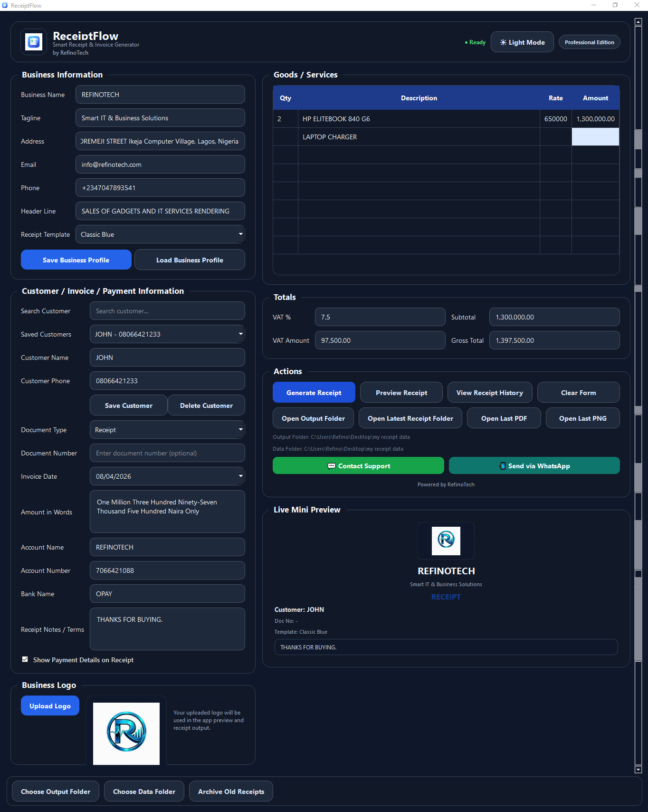
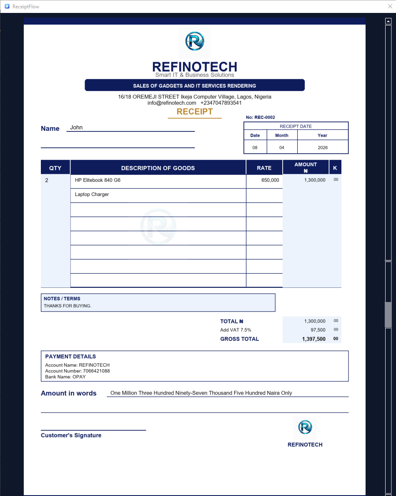

# ReceiptFlow

ReceiptFlow is a desktop application built with Python and PySide6 for generating professional receipts and invoices with live preview, business branding, folder organization, and PDF export.

## Features

- Light and dark mode
- Receipt and invoice generation
- PNG and PDF export
- Business profile save/load
- Customer save, load, and search
- Live mini preview
- Output folder selection
- Data folder selection
- Auto year/month folder organization
- Archive old receipts
- WhatsApp integration
- Splash screen and branding

## Tech Stack

- Python
- PySide6
- Pillow
- ReportLab
- num2words

## How to Run

1. Install dependencies

```bash
pip install -r requirements.txt

2. Run the app

```bash
python app.py

# Screenshots

(screenshots/light-mode.png)






Author

Promise Esemuede
GitHub: Refino17
